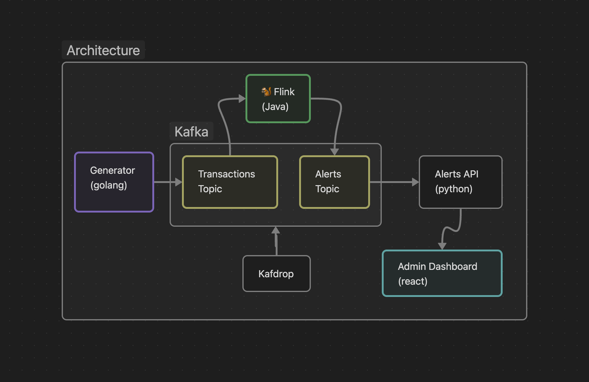

# Fraud Detection

Rozwiązanie składa się z wielu modułów.

Projekt można uruchomić korzystając z polecenia `docker compose up`. Należy chwilę odczekać, gdyż Kafka się długo uruchamia i dopiero po jej uruchomieniu rozwiązanie zaczyła działać stabilnie.

## Generator
Tworzy losowe transakcje które są zapisywane na topic Kafki `transactions` w formacie JSON.
Parametry generatora można zmieniać poprzez parametry w pliku `docker-compose.yaml`.

## Flink
Zarządza i uruchamia algorytmy sprawdzające oszustwa. Czyta z topicu Kafki `transactions`, a zapisuje wyniki do topicu `alerts`.

Jest kilka algorytmów sprawdzających wiarygodność transakcji.
- `ExpiredCardDetector` - sprawdza czy transakcja nie odbyła się po skończeniu ważności karty,
- `OverLimitDetector` - sprawdza czy transakcja mieści się w limicie,
- `SmallThenLargeDetector` - sprawdza czy w okienku minutowym nie dopuszczono się małej transakcji (poniżej 20 zł), po czym wykonano dużą transakcję (powyżej 500 zł),
- `NormalDistributionDetector` - oblicza parametry rozkładu normalnego: średnią oraz wariancję, a na ich podstawie odrzuca transakcje które są oddalone od średniej o więcej niż odchylenie standardowe. 

Algorytmy zapisane są w folderze `frauddetection/src/java/spendreport/detectors`.

## Alerts Reader
Zczytuje alerty z topicu Kafki `alerts` i przekazuje je klientom nasłuchującym na Websockecie.

## Dashboard
Łączy się z Alerts Reader po Websockecie i na żywo wyświetla alerty oraz zlicza je na wykresie w okienkach 30 sekundowych.

## Kafka i Kafdrop
Kafka ma dwa topici umożliwiające komunikację. Działanie Kafki możemy podejrzeć korzystając z interfejsu graficznego Kafdrop.