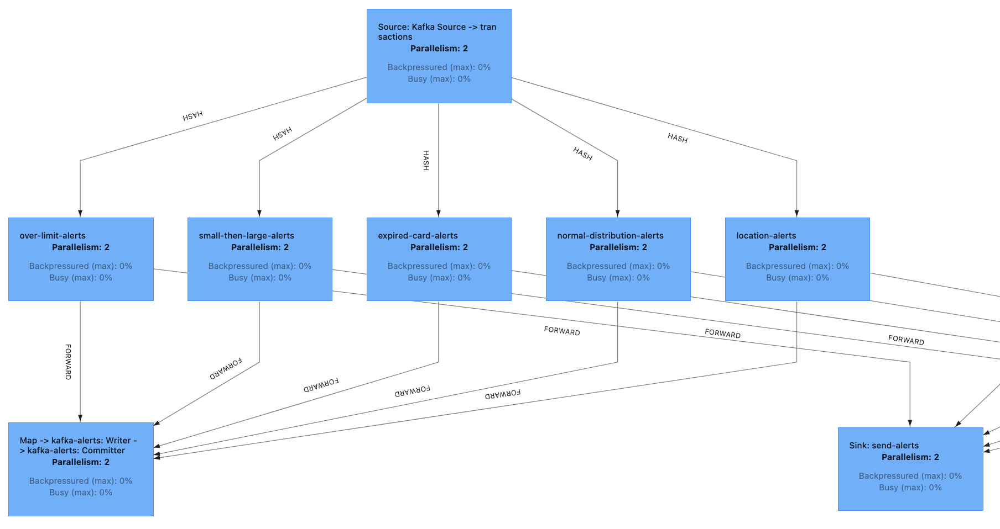
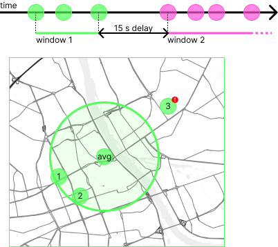

## Fraud detection

Kluczowy moduł aplikacji odpowiedzialny za przetwarzanie danych w czasie rzeczywistym.
Wykorzystuje on bibliotekę Flink oraz jest napisany w Java 11.
Zczytuje dane (source) z topiku `transactions` Kafki, a następnie przekazuje je do detektorów. 
Same detektory działają równolegle i przekazują wykryte anomalie zarówno do topiku `alerts` Kafki, a także do procesu `AlertSink`, który loguje na bieżąco alerty.

Do przekazywania informacji wykorzystywane są `DataStream` w przypadku alertów oraz `KeyedStream` w przypadku transakcji.
Część detektorów, m.in. `NormalDistributionDetector` korzysta ze stanu przechowywanego przez Flink.
`KeyedStream` jest wymagany, aby wymusić przetwarzanie przez ten sam proces kolejnych transakcji z tej samej karty.
W przeciwnym wypadku przy rozproszonym przetwarzaniu moglibyśmy mieć problemy z niespójnym stanem, brudnymi odczytami, czy zbędnym i czasochłonnym przenoszeniem stanu między procesami.
Opis przepływu danych i konfiguracja połączeń z Kafką są zapisane w `FraudDetectionJob.java`.
Zależności między taskami we Flinku przedstawione są poniżej w postaci grafu:

### Detektory
Detektory działają niezależnie od siebie i są uruchamiane równolegle. Kod detektorów znajduje się w pakiecie `spendreport.detectors`.

#### `ExpiredCardDetector`
Sprawdza czy transakcja nie odbyła się po skończeniu ważności karty. Jest to najprostszy detektor, który nie wymaga stanu. Porównuje on datę transakcji z datą ważności karty.

#### `OverLimitDetector`
Sprawdza czy transakcja mieści się w limicie. Jako, że limit jest przekazywany w transakcji, to nie wymaga on stanu.

#### `SmallThenLargeDetector`
Sprawdza, czy po małej transakcji (poniżej 20 zł), nie dopuszczono się dużej transakcji (powyżej 500 zł) w okresie 1 minuty. Wykorzystuje stan przechowujący flagę, czy w ciągu ostatniej minuty była mała transakcja, a także zapisuje czas ostatniej małej transakcji. Korzysta także z `timerService` Flinka, aby po minucie wyczyścić stan.
Kod jest adaptowany z przykładu [Flinka](https://nightlies.apache.org/flink/flink-docs-release-1.17/docs/try-flink/datastream/).

#### `NormalDistributionDetector`
Na bieżąco oblicza średnią i odchylenie standardowe transakcji z danej karty. Następnie sprawdza, czy transakcja nie odbiega od średniej o więcej niż odchylenie standardowe. Wykorzystuje stan pozwalający na obliczenie parametrów rozkładu normalnego zgodnie z algorytmem [Welford Online Algorithm](https://en.wikipedia.org/wiki/Algorithms_for_calculating_variance#Welford's_online_algorithm).

#### `LocationDetector`
Korzystając z [Session Windows](https://nightlies.apache.org/flink/flink-docs-master/docs/dev/datastream/operators/windows/#session-windows) tworzy okna dla każdej karty kredytowej rozdzielone 15 sekundowymi przerwami. Następnie dla transakcji z okna wylicza średnią lokalizację i dla ustalonego promienia sprawdza czy transakcja nie odbyła się za daleko od średniej lokalizacji.

### Dockerfile
Flink umożliwia przekazywanie Job w postaci artefaktów JAR na [dwa sposoby](https://nightlies.apache.org/flink/flink-docs-master/docs/deployment/resource-providers/standalone/docker/#deployment-modes): Session Mode i Application Mode.
Pierwszy z nich pozwala na dołączanie JAR w runtime Flinka, a drugi poprzez dołączenie ich do odpowiedniego folderu.
W projekcie wykorzystywana jest opcja druga.

W pliku `Dockerfile` możemy zauważyć, że projekt jest najpierw kompilowany przy użyciu Maven, a następnie stworzony JAR jest kopiowany do obrazu Flinka w katalogu `/opt/flink/usrlib/`.

Następnie w `docker-compose.yml` stworzone zostały dwa rodzaje kontenerów na podstawie jednego obrazu.
Są to `jobmanager` oraz `taskmanager`.
Do uruchomienia `jobmanager` wykorzystywane jest polecenie Flink `standalone-job` w którym przekazujemy klasę opisującą Job, czyli w naszym przypadku `--job-classname spendreport.FraudDetection`.
Z drugiej strony mamy `taskmanager`, który będzie wykonywał pojedyncze taski. Uruchamiany jest na tym samym obrazie co `jobmanager`, tylko z poleceniem `taskmanager`.
Dodatkowo możemy zwiększyć liczbę kontenerów `taskmanager` poprzez zwiększenie parametru `scale` (domyślnie: 1).

W zmiennych środowiskowych ustawiane są wspólnie `jobmanager.rpc.address` wzkazujący adres jobmanagera oraz `parallelism.default` mówiący o ilości działających równolegle tasków tego samego rodzaju.
Warto zauważyć, że `jobmanager.rpc.address` ma ustawiony adres jaki przypisze mu `docker-compose`, czyli w tym przypadku skoro nazwaliśmy go `jobmanager`, to `jobmanager.rpc.address: jobmanager`.
W `taskmanager` ustalany jest także `taskmanager.numberOfTaskSlots`.