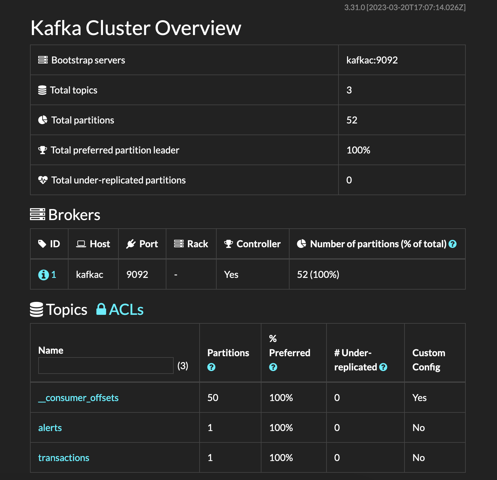

## Kafka

Kafka umożliwia komunikację między modułami przez zapisywanie eventów takich jak transakcje i alerty na odpowiadających im topicach: `transactions` i `alerts`.

### Dockerfile 
Konfiguracja Kafki, a szczególnie jej sieci przy korzystaniu z `docker-compose.yml` wymaga dużej uwagi.
Nie istnieje oficjalnie wspierany przez Apache obraz Kafki, dlatego zdecydowano się na jedną z popularniejszych dystrybucji `bitnami/kafka`.

Aby uniknąć potencjalnej kolizji nazw kontener z Kafką nazwany jest inaczej niż `kafka`, w naszym przypadku `kafkac`.
Została też stworzona wewnętrzna sieć `kafka-network`, zapewniająca izolację Kafki.
Ustawiono także następujące zmienne środowiskowe:
- `ALLOW_PLAINTEXT_LISTENER=yes` umożliwia łączenie się z Kafką bez autentykacji i bez enkrypcji wiadomości.
- `KAFKA_CFG_AUTO_CREATE_TOPICS_ENABLE=true` umożliwia zapisywanie, bądź odczytywanie z jeszcze niestworzonych topiców. Kafka zajmie się ich stworzeniem za nas.
- `KAFKA_CFG_ADVERTISED_LISTENERS=PLAINTEXT://kafkac:9092` - opisuje za pomocą jakiego protokołu będziemy mogli się połączyć po jakim adresie. W tym przypadku kontenery wewnątrz sieci `kafka-network` będą mogły się łączyć z Kafką poprzez protokół `PLAINTEXT` i adres `kafkac:9092`.
- `BITNAMI_DEBUG=yes` przekazuje więcej informacji do logów, co umożliwia sprawniejsze debugowanie konfiguracji Kafki.

Zauważmy, że nowsze wersje Kafki nie wymagają do działania Zookeepera i używają domyślnie własnej implementacji algorytmu RAFT.

## Kafdrop

Do podglądu własności Kafki i jej topików została dołączona do `docker-compose` aplikacja Kafdrop. Dostępna jest domyślnie na [http://localhost:9000]().

